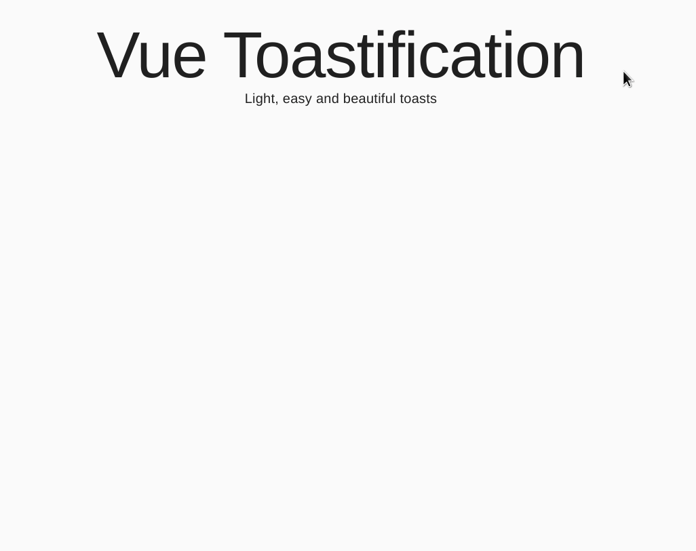

# 章節 3 ｜ Vite + 元件化 + Plugins

## <a id="目錄"></a>目錄

- [3-1 元件化開發](#CH3-1)
  - [1. 什麼是元件？](#CH3-1-1)
  - [2. 為什麼需要元件？](#CH3-1-2)
  - [3. Vue 元件結構：SFC (Single File Component)](#CH3-1-3)
  - [4. 瀏覽器不懂 `.vue` 格式，所以需要 Vite](#CH3-1-4)
  - [5. Node.js 與 npm](#CH3-1-5)
- [3-2 使用 Vite 建立專案](#CH3-2)
  - [1. 建立步驟](#CH3-2-1)
  - [2. 專案結構解析](#CH3-2-2)
  - [3. SFC `<script setup>` 語法糖](#CH3-2-3)
  - [4. 元件命名慣例](#CH3-2-4)
  - [5. 元件化開發](#CH3-2-5)
- [3-3 元件 Props (父元件傳遞資料至子元件)](#CH3-3)
  - [1. Props 驗證 (Validation)](#CH3-3-1)
- [3-4 Emit (子元件傳遞事件至父元件)](#CH3-4)
  - [1. 觸發自定義事件前的驗證](#CH3-4-1)
- [3-5 provide / inject (跨層級資料傳遞)](#CH3-5)
- [3-6 元件生命週期 (Lifecycle Hooks)](#CH3-6)
  - [1. 常用 Hook](#CH3-6-1)
  - [2. 示意圖概念](#CH3-6-2)
- [3-7 Slot (插槽)](#CH3-7)
  - [1. 具名插槽 (Named Slots)](#CH3-7-1)
- [3-8 動態元件 (Dynamic Components)](#CH3-8)
  - [1. 基本用法](#CH3-8-1)
  - [2. KeepAlive](#CH3-8-2)
- [3-9 Plugins (插件)](#CH3-9)
  - [1. 使用插件](#CH3-9-1)
  - [2. 撰寫簡易插件](#CH3-9-2)
- [3-10 元件拆分策略](#CH3-10)
  - [1. 拆分原則](#CH3-10-1)
  - [2. 異步元件 (Async Components)](#CH3-10-2)

---

### 序

恭喜你完成了 Vue 的基礎課程！

到了這個章節，我們要開始進入「**現代化前端開發**」的領域了。

在前兩章，我們用最簡單的 CDN 方式來學習 Vue，這非常適合用來理解核心概念。但在真實的職場開發中，為了追求更好的效能、更易維護的程式碼結構，以及團隊協作的需求，我們需要更強大的工具。

本章節將帶你認識 **Vite** 這款極速建置工具，並深入探討 Vue 最強大的特性——**元件化 (Component-Based Development)**。這不僅是技術工具的轉換，更是開發思維的升級。掌握了元件化，你將能夠像堆積木一樣，靈活地組裝出複雜且龐大的應用程式。

準備好升級你的開發裝備了嗎？讓我們開始吧！

---

## <a id="CH3-1"></a>[3-1 元件化開發](#目錄)

在前一章節中，我們使用了 CDN 方式進行開發。但隨著專案規模擴大，單一 HTML 檔案的開發模式將變得難以維護。這時候，我們需要引入「**元件化 (Component-Based)**」的開發思維。

### <a id="CH3-1-1"></a>[1. 什麼是元件？](#目錄)

想像一下**新房裝潢**的過程。

一個完整的客廳（完整的網頁），是由許多獨立的物品組合而成的：

- **沙發** (Component A)
- **冷氣** (Component B)
- **電視** (Component C)

每一個物品（元件）都有自己的功能、樣式與邏輯，並且可以被獨立拆卸或替換。

在 Vue 的開發中，一個按鈕 (Button)、一個導覽列 (Navbar)、甚至是一個產品卡片 (ProductCard)，都可以被視為一個**元件**。

### <a id="CH3-1-2"></a>[2. 為什麼需要元件？](#目錄)

- **可重複使用 (Reusability)**：
  如果客廳和臥室都需要冷氣，我們不需要重新發明一台冷氣，只需要再買一台一樣的型號安裝上去即可。
  同理，如果在網頁中多個地方需要同一個按鈕樣式，我們不需要每次都重寫 HTML、CSS 和 JS，只需要重複使用同一個元件。

- **易於維護 (Maintainability)**：
  如果冷氣壞了，我們只需要修理冷氣本身，而不會影響到沙發或電視。
  元件化讓程式碼職責分離，修改某個功能時比較不會牽一髮而動全身。

### <a id="CH3-1-3"></a>[3. Vue 元件結構：SFC (Single File Component)](#目錄)

在 Vue 專案開發中，我們使用 `.vue` 檔來定義一個元件。這種檔案格式稱為 **SFC (Single File Component，單一檔案元件)**。

一個 `.vue` 檔案通常包含三個區塊，就像把 HTML、CSS、JS 封裝在一起：

```html
<script setup>
  // 這裡寫 JavaScript (邏輯)
</script>

<template>
  <!-- 這裡寫 HTML (結構) -->
  <div class="sofa">舒適的沙發</div>
</template>

<style scoped>
  /* 這裡寫 CSS (樣式) */
  .sofa {
    color: brown;
  }
</style>
```

> 💡 **備註：關於區塊順序**
>
> 官方 [Style Guide](https://vuejs.org/style-guide/rules-recommended.html#single-file-component-top-level-element-order) 建議的順序為：
>
> 1. `<script>`
> 2. `<template>`
> 3. `<style>`
>
> 這是因為開發者在維護元件時，通常需要先了解「程式邏輯」與「狀態定義」。不過，實務上也有許多團隊習慣將 `<template>` 放在最上方（因為直覺上會認為介面結構比較重要）。這部分並沒有絕對的對錯，Vue 對此相當彈性，只要團隊內部**保持統一**即可。

### <a id="CH3-1-4"></a>[4. 瀏覽器不懂 `.vue` 格式，所以需要 Vite](#目錄)

雖然 SFC 結構很清晰，但瀏覽器**不懂** `.vue` 這種檔案格式。瀏覽器只懂得 `.html`, `.js`, `.css`。

為了讓瀏覽器能讀取我們的 Vue 元件，我們需要一個「**翻譯機**」把 `.vue` 檔案**編譯**成瀏覽器看得懂的 `.html`、`.js` 和 `.css`。

這個翻譯機（建置工具）就是 **Vite**。
Vite 是一個現代化的前端建置工具，它的速度極快，負責幫我們處理編譯、打包與開發伺服器的啟動。

### <a id="CH3-1-5"></a>[5. Node.js 與 npm](#目錄)

要讓 Vite 這台高性能引擎運作，它需要一個執行環境，那就是 **Node.js**。
而 Node.js 附帶的 **npm (Node Package Manager)**，則是套件管理工具，我們需要用它來安裝 Vite 以及 Vue 本身。  
原則上 LTS 版本的 Node.js 都有附帶 npm，並且都能支援 Vite，故我們只需安裝最新的 LTS 版本即可。

> **LTS (Long Term Support)**：  
> 長期支援版本會有更長的維護期，因此推薦使用 LTS 版本。

Node.js 的載點請參考 [Node.js 官方網站](https://nodejs.org/en/download/)。

---

## <a id="CH3-2"></a>[3-2 使用 Vite 建立專案](#目錄)

瞭解了上述概念後，我們現在可以開始建立一個真實的 Vue 專案了。

### <a id="CH3-2-1"></a>[1. 建立步驟](#目錄)

請開啟終端機 (Terminal)，執行以下指令：

```bash
npm create vue
```

以上指令同等於

```bash
npm create vite@latest
```

第一次執行指令可能會跳出以下提示，輸入 **y** 或者直接按 **Enter** 確認

```plaintext
Need to install the following packages:
create-vue@3.18.3
Ok to proceed? (y)
```

這個指令會啟動 **create-vue** (Vue 官方的專案建置工具)。
執行後，終端機會出現一系列的詢問。在本教學中，我們將建立一個最基礎的 Vue 專案，因此除了專案名稱外，其餘選項請都選擇 **「否」(No)**：

```plaintext
Vue.js - The Progressive JavaScript Framework

√ 請輸入專案名稱： ... test-vue
√ 是否使用 TypeScript 語法？ ... 否
√ 是否啟用 JSX 支援？ ... 否
√ 是否引入 Vue Router 進行單頁應用開發？ ... 否
√ 是否引入 Pinia 用於狀態管理？ ... 否
√ 是否引入 Vitest 用於單元測試 ... 否
√ 是否要引入一款端對端（End to End）測試工具？ » 不需要
√ 是否引入 ESLint 用於程式碼品質檢測？ ... 否

正在建置專案 .../test-vue...
```

> **提示**：使用鍵盤的方向鍵 `←` `→` 來切換選項，按 `Enter` 確認。

專案建置完成後，請依序執行以下指令來進入資料夾並啟動專案：

```bash
cd test-vue # 將當前路徑切換到 test-vue 專案目錄中
npm install # 安裝專案依賴，會掃描專案中的 package.json
npm run dev # 啟動專案
```

### 💡 備註：關於 Node.js 的 npm (Node Package Manager)

Node Package Manager (npm) 是隨同 Node.js 一起安裝的套件管理工具，有點類似 Java 的 Maven。  
它能解決 Node.js 程式碼部署上的很多問題，常見的使用情境有以下幾種：

1.  **允許開發者從 npm 伺服器下載別人編寫的第三方套件到本地使用。**
2.  **允許開發者從 npm 伺服器，下載並安裝別人編寫的命令行程序到本地使用。**
3.  **允許開發者將自己編寫的套件或命令行程序上傳到 npm 伺服器供別人使用。**

常用指令：

- `npm install`：掃描專案中的 `package.json`，下載並安裝所有專案依賴。
- `npm install <package-name>`：安裝特定套件。
- `npm install <參數>`：
  - `-D`：安裝為開發依賴 (devDependencies)，例如測試工具或編譯工具。
  - `-g`：安裝到全域環境 (Global)，通常是為了在任何地方都能使用該指令。
  - `-f`：強制安裝 (Force)，當遇到版本衝突或快取問題時使用。
  - `--production`：僅安裝 `dependencies` 中的套件，忽略開發用途的依賴。
- `npm run <script-name>`：執行 `package.json` 中定義的腳本。
- `npm update`：更新套件。
- `npm uninstall`：移除套件。

### <a id="CH3-2-2"></a>[2. 專案結構解析](#目錄)

開啟專案後，你會看到以下結構：

```plaintext
root/
├── 📄.vscode/          # VS Code 的專案設定檔 (如推薦套件)
├── 📁node_modules/     # 存放此專案所有 npm 安裝的依賴套件 (不可手動修改)
├── 📁public/           # 靜態資源目錄 (不會被 Vite 編譯)
│   └── 📄favicon.ico
├── 📁src/              # 主要開發目錄 (原始碼)
│   ├── 📁assets/       # 靜態資源 (圖片、CSS 等，會被 Vite 編譯)
│   ├── 📁components/   # Vue 元件 (Button.vue, Navbar.vue 等)
│   ├── 📄App.vue       # 根元件 (Root Component)
│   └── 📄main.js       # 程式進入點 (Entry Point)
├── 📄.gitignore        # Git 版本控制忽略清單
├── 📄index.html        # 網頁入口 (Entry HTML)
├── 📄jsconfig.json     # JavaScript 專案設定 (如路徑別名)
├── 📄package.json      # 專案設定檔 (依賴清單、腳本命令)
├── 📄vite.config.js    # Vite 設定檔
└── 📄README.md         # 專案說明文件
```

### 關鍵檔案說明

1.  **`index.html`**：  
    這是專案的「進入點」，是瀏覽器第一個載入的檔案；這也是 SPA (Single Page Application) 單頁應用程式的「單頁」。  
    與傳統開發不同，這裡的 `index.html` 位於專案根目錄，且引入的是用 `<script type="module">` 載入的 `src/main.js`。
    Vite 會解析這個檔案，並自動打包引入的 JavaScript 和 CSS。

2.  **`src/main.js`**：  
    這是 Vue 應用程式的「啟動引擎」。
    它負責：

    - 引入 Vue 函式庫 (`createApp`)。
    - 引入根元件 (`App.vue`)。
    - 引入全域樣式 (`style.css` 或其他)。
    - 建立 Vue 實例並「掛載 (mount)」到 `index.html` 中的 `#app` 元素上。

3.  **`src/App.vue`**：  
    這是 Vue 的「根元件」。  
    所有的頁面、元件，最終都會被包在這個元件裡面顯示。

4.  關於 **`public/` 與 `src/assets/`** 的區別：

    - **📁 `public/`**：
      這裡的檔案**不會**經過 Vite 編譯或雜湊 (hash)，打包時會原封不動複製到根目錄。

      - **用途**：適合放 `favicon.ico`、`robots.txt` 或不需要被程式碼引用的靜態檔案。
      - **引用**：直接使用絕對路徑，如 ``。

    - **📁 `src/assets/`**：
      這裡的檔案**會**經過 Vite 編譯、壓縮並加上雜湊檔名 (避免快取問題)。
      - **用途**：適合放專案內會被元件引用 (import) 的圖片、CSS、SVG 等。
      - **引用**：需透過 `import` 或相對路徑引用，如 `import logo from '@/assets/logo.png'`。

    > **簡單原則**：
    >
    > - 如果要讓程式碼使用 (import) → 放 `src/assets`
    > - 如果要直接透過網址存取 → 放 `public`

5.  **`vite.config.js`**：  
    Vite 的控制中心，負責定義專案的建置行為，常見設定如下：

    - **Plugins**：插件，例如 `@vitejs/plugin-vue`，這就是為什麼 Vite 看得懂 Vue 的 `.vue` 檔。
    - **Alias**：別名，預設配置了 `@` 指向 `src/` 目錄，讓我們在 import 時可以使用絕對路徑 (如 `import ... from '@/components/...'`)，避免出現可怕的 `../../../`。
    - **Server Proxy**：反向代理伺服器，可解決開發時 API 跨域問題 (CORS) 的重要設定。

6.  **`package.json`**：  
    專案的「身分證」與「說明書」，記錄了專案名稱、版本、以及安裝了哪些套件。
    - **`scripts`**：常用的指令腳本。例如 `npm run dev` 其實是去執行 `vite` 指令；`npm run build` 是執行 `vite build`。
    - **`dependencies`** (生產環境依賴)：
      專案「執行時」真正需要的套件。例如 `vue`、`vue-router`、`pinia`。
      (這些程式碼會被打包進去給使用者下載)
    - **`devDependencies`** (開發環境依賴)：
      只有在「開發期間」或「打包過程」需要的工具。例如 `vite`、`sass`、`eslint`。
      (這些不會被打包到最終產品中)

### <a id="CH3-2-3"></a>[3. SFC `<script setup>` 語法糖](#目錄)

在前兩個章節，我們學習了標準的 **Composition API** 寫法，必須使用 `setup()` 函式並將變數 `return` 出來，`<template>` 模板才能使用。

```html
<!-- 標準寫法 -->
<script>
  import { ref } from "vue";
  export default {
    setup() {
      const count = ref(0);
      return { count }; // 必須回傳，template 才看得到
    },
  };
</script>
```

在 Vite 專案 (SFC) 中，Vue 3 官方強烈推薦使用 **`<script setup>`** 語法糖。這能讓程式碼大幅簡化：

```html
<!-- 推薦寫法 -->
<script setup>
  import { ref } from "vue";
  const count = ref(0); // 直接宣告即可使用，會自動匯出
</script>
```

**`<script setup>` 的優勢：**

- **更少樣板代碼**：不需要 `export default`，也不用 `setup()` 函式。
- **不需要 return**：頂層宣告的變數、函式、import 的內容，在 `<template>` 中**自動可用**。
- **更佳的執行效能**：編譯出的程式碼比標準 `setup()` 函式更高效。
- **Vue 3 最佳實作**：這種寫法是 Vue 3 官方推薦的最佳實作。

### <a id="CH3-2-4"></a>[4. 元件命名慣例](#目錄)

在 Vue 開發中，遵循一致的命名慣例非常重要，這能提高程式碼的可讀性並避免潛在錯誤。官方強烈建議遵循 [Style Guide](https://vuejs.org/style-guide/) 的規範：

1.  **檔案名稱使用 PascalCase (大駝峰)**：

    - **推薦**：`UserProfile.vue`、`ProductCard.vue`
    - **避免**：`userprofile.vue`、`produce-card.vue`
    - **原因**：PascalCase 在編輯器中更顯眼，且與 JS Class 的命名習慣一致。

2.  **元件名稱必定由「多個單字」組成**：

    - **推薦**：`TodoItem.vue`、`AppHeader.vue`
    - **避免**：`Todo.vue`、`Header.vue`
    - **原因**：避免與現有 (如 `<header>`) 或未來可能新增的 HTML 原生標籤衝突。所有的 HTML 原生標籤都是單個單字。

3.  **在 Template 中的使用方式**：
    - 在 SFC (單一檔案元件) 中，推薦使用 **PascalCase** 標籤，例如 `<UserProfile />`。
    - **原因**：這能讓你一眼看出它是個 Vue 元件，而不是原生 HTML 標籤。
    - Vue 也支援 kebab-case 風格 `<user-profile />`，但在專案內請盡量保持統一風格。

### <a id="CH3-2-5"></a>[5. 元件化開發](#目錄)

我們已經學會了如何建立專案、理解了 SFC 架構與命名慣例，現在讓我們實際來「**使用**」一個元件。

在 Vite 專案中，使用元件的流程非常直覺，只需要兩個步驟：**引入 (Import)** 與 **使用 (Usage)**。

#### 步驟 1：建立並定義元件

假設我們有一個 `src/components/MyCard.vue`：

```html
<script setup>
  // 這裡可以寫卡片的邏輯
</script>

<template>
  <div class="card">
    <div class="card-body">這是一張卡片</div>
  </div>
</template>

<style scoped>
  .card {
    border: 1px solid #ddd;
    border-radius: 8px;
    padding: 16px;
    margin: 10px;
    box-shadow: 0 2px 4px rgba(0, 0, 0, 0.1);
  }
</style>
```

#### 步驟 2：引入並使用元件

回到我們的根元件 `src/App.vue`：

```html
<script setup>
  // 1. 引入元件
  // 只要引入了，在 <script setup> 中就可以直接使用，不需要額外註冊
  import MyCard from "./components/MyCard.vue";
</script>

<template>
  <div>
    <h1>歡迎來到 Vue</h1>
    <!-- 2. 使用元件 -->
    <MyCard />
    <MyCard />
  </div>
</template>
```

**重點整理**：

1.  使用 `import` 引入 `.vue` 檔案。
2.  在 `<template>` 中像 HTML 標籤一樣使用它。
3.  元件可以被重複使用多次，每個元件都是獨立的實例。

> ### 💡 備註：關於標準開發模式與樣式隔離
>
> 1.  **標準 `setup()` 與 Options API**：  
>     在 `<script setup>` 中，引入的元件可以直接使用。但在標準的 `setup()` 或 Options API (`export default {}`) 中，必須在 `components` 選項中註冊才能使用。
>
>     ```javascript
>     export default {
>       components: {
>         MyCard, // 註冊元件
>       },
>       setup() {
>         // ...
>       },
>     };
>     ```
>
> 2.  **`<style scoped>` 的意義**：  
>     在 `.vue` 檔中，`<style>` 標籤通常會加上 `scoped` 屬性。這代表這裡寫的 CSS **只會影響目前這個元件**，不會汙染到其他元件或全域樣式。Vue 會自動幫這些 class 加上特殊的雜湊屬性（如 `data-v-xxxx`）來達成隔離效果。

---

## <a id="CH3-3"></a>[3-3 元件 Props (父元件傳遞資料至子元件)](#目錄)

元件化開發是將頁面拆解為獨立、可重用的區塊。但是在拆解後，原本在同一個檔案中的變數（資料），現在被隔離在不同的元件檔案中。  
**Props** 機制就是由「父元件」向「子元件」傳遞資料溝通的橋樑。

### <a id="CH3-3-1"></a>[1. 基礎用法](#目錄)

在 `<script setup>` 中，我們使用 `defineProps` 方法來宣告子元件可接受的 Props。如果不需要對資料進行嚴格驗證，最簡單的方式是使用**字串陣列**。

```html
<!-- MyCard.vue -->
<script setup>
  // 宣告此元件接受 title 與 price 兩個 Props 參數。
  const props = defineProps(["title", "price"]);

  // 使用 Props
  console.log(props.title, props.price);
</script>
```

### <a id="CH3-3-2"></a>[2. Props 驗證 (Validation)](#目錄)

在實際開發中，我們強烈建議對 Props 進行**型別驗證**，這有點像是為你的元件寫一份說明書，明確告訴使用這個元件的開發者（包含你自己）：「這個元件需要什麼資料？應該是什麼類型？有沒有預設值？」

我們以 `MyCard.vue` 為例：

**子元件 (MyCard.vue)：**

```html
<script setup>
  defineProps({
    // 1. 基礎型別檢查 (Basic Type Check)
    title: String,

    // 2. 多種型別允許 (Multiple Types)
    id: [String, Number],

    // 3. 進階驗證 (Advanced Validation)
    price: {
      type: Number,
      required: true, // 必填：若父元件沒傳會跳出警告
      default: 100, // 預設值：若沒傳則為 100
      validator(value) {
        // 自訂驗證邏輯：價格必須是非負數
        return value >= 0;
      },
    },

    // 4. 物件或陣列的預設值 (Object/Array Default)
    tags: {
      type: Array,
      // 注意：物件或陣列的預設值必須由一個 factory function 回傳
      default: () => [],
    },
  });
</script>

<template>
  <div class="card">
    <h3>{{ title }}</h3>
    <p>Price: ${{ price }}</p>
  </div>
</template>
```

**父元件 (App.vue)：**

```html
<script setup>
  const bookList = [
    { id: 1, title: "Vue 3 入門", price: 100 },
    { id: 2, title: "Vue 3 高階", price: 200 },
    { id: 3, title: "Vue 3 魔法", price: 300 },
  ];
</script>

<template>
  <!-- 1. 傳遞靜態字串 -->
  <MyCard title="Vue 3 入門" />

  <!-- 2. 透過 v-bind 傳遞動態資料 (數字、變數等) -->
  <!-- 若未傳遞 price，將使用預設值 100 -->
  <MyCard title="進階實戰" :price="500" />

  <!-- 3. 用迴圈產生多個元件 -->
  <MyCard
    v-for="book in bookList"
    :key="book.id"
    :title="book.title"
    :price="book.price"
  />
</template>
```

---

### <a id="CH3-3-3"></a>[3. 單向資料流 (One-Way Data Flow)](#目錄)

所有的 Props 都遵循**單向綁定**原則，屬性會從父元件流向子元件。當父元件的屬性改變時，會傳導給子元件，但是反過來則不會。

- **唯讀 (Read-only)**：子元件<span style="color: LightCoral;">不應該</span>嘗試修改 Props 的值。
- **原因**：為了防止子元件意外改變父元件的狀態，導致資料流向難以理解，進而造成維護上的困難。

如果你嘗試在 Component 中修改 Props：

```javascript
/* MyCard.vue */
const props = defineProps(["title"]);

// ❌ 警告：props 是唯讀的！
props.title = "新標題";
```

Vue 會在控制台發出警告。若子元件需要根據 Props 進行修改（例如將其作為初始值），應該將其複製到自己的 `ref` 中，或是使用 `computed` 產生衍生資料。

#### 1. 使用 ref 複製初始值

若只是想將 Props 當作「初始值」使用，後續的變化與父元件無關，可以將其賦值給 `ref`：

```javascript
const props = defineProps(["initialCounter"]);

// 只是將 props.initialCounter 當作初始值
// 之後 localCounter 的變化不會影響到父元件
const localCounter = ref(props.initialCounter);
```

#### 2. 使用 computed 產生衍生資料

若需要根據 Props 的變化來即時計算出新的結果，請使用 `computed`：

```javascript
const props = defineProps(["price", "discount"]);

// 當 props.price 或 props.discount 改變時，finalPrice 會自動更新
const finalPrice = computed(() => {
  return props.price * props.discount;
});
```

### <a id="CH3-3-4"></a>[4. 重點整理](#目錄)

1.  **Props 是什麼**：父元件傳遞資料給子元件的方法。
2.  **如何宣告**：使用 `defineProps`。
3.  **驗證建議**：建議使用**物件語法**進行型別與預設值設定。
4.  **唯讀特性**：Props 是**單向資料流**，子元件不可直接修改。
5.  **在子元件中修改 Props 的方式**：
    - 使用 `ref` 複製初始值
    - 使用 `computed` 產生衍生資料

### <a id="CH3-3-5"></a>[5. 單向資料流？有時候事情並沒有這麼簡單...](#目錄)

雖然 Props 很方便，但如果有時候我們<span style="color: LightCoral;"> 必須 </span>修改父元件傳下來的資料呢？  
例如一個「開關 (Toggle Switch)」元件，父元件傳入 `isOpen` (true/false) 來決定開關狀態。當使用者點擊開關時，子元件希望能把 `isOpen` 改成 `!isOpen`。

**錯誤的嘗試：**

```html
<!-- 請觀察以下程式碼，思考兩件事: 誰持有資料 isOpen？ 誰「該」修改 isOpen？ -->

<!-- ParentComponent.vue -->
<script setup>
  const isOpen = ref(false);
</script>

<template>
  <ToggleSwitch :isOpen="isOpen" />
</template>

<!-- ToggleSwitch.vue -->
<script setup>
  const props = defineProps(["isOpen"]);

  const toggle = () => {
    // ❌ 錯誤！Props 是唯讀的 (Read-only)，不能直接修改
    props.isOpen = !props.isOpen;
  };
</script>

<template>
  <button @click="toggle">{{ props.isOpen ? 'ON' : 'OFF' }}</button>
</template>
```

這時候 Vue 就會發出警告。因為根據單向資料流原則，子元件只能「**讀取**」資料，不能「**修改**」資料。

那該怎麼辦？  
這時候我們需要一種機制，讓子元件可以「**通知**」父元件：「嘿！使用者按了開關，麻煩你幫我更新一下資料。」

這個機制就是 **Emit**。

---

## <a id="CH3-4"></a>[3-4 Emit (子元件傳遞事件至父元件)](#目錄)

Props 的資料流向是單向的（父傳子）。如果子元件需要通知父元件進行資料更新或執行特定動作，就必須使用 **Emit** 機制。  
延續前面的開關範例，既然子元件無法直接修改 Props 中的資料，我們可以改為「發送一個訊號（事件）」給父元件，請求父元件來執行修改。

> **💡 觀念解析：Emit 運作流程**
>
> Emit 機制對於初學者來說可能稍顯陌生，我們可以將其拆解為四個步驟：
>
> 1.  **子元件定義事件**：子元件宣告自己可能會發出哪些事件 (使用 `defineEmits`)。
> 2.  **父元件監聽事件**：父元件像監聽 `click` 原生事件一樣，監聽子元件宣告的自定義事件。
> 3.  **子元件觸發事件**：在特定時機（如按鈕點擊），子元件主動觸發該事件，並可視需求附帶資料。
> 4.  **父元件回應事件**：父元件捕捉到事件後，執行對應的函式來更新自己的資料。
>
> **白話點就是：**  
> **(1) 定義與監聽**  
> 子元件：「我在身上註冊了一個 **『開關被切換』** 的事件，請注意喔！」  
> 父元件：「收到，我會監聽這個事件。一旦發生，我就會更新我的資料。」
>
> **(2) 觸發與回應**  
> 子元件：「(偵測到使用者點擊) 就在現在！ **『開關被切換』** 事件觸發了！」  
> 父元件：「收到訊號！我現在立刻更新資料。」

### <a id="CH3-4-1"></a>[1. 基礎用法](#目錄)

**第一步：子元件準備事件**

在子元件中，我們使用 `defineEmits` 來定義可以發送哪些事件。

```html
<!-- ToggleSwitch.vue -->
<script setup>
  const props = defineProps(["isOpen"]);

  // 1. 定義事件名稱，例如 'update-is-open'
  const emit = defineEmits(["update-is-open"]);

  const toggle = () => {
    // 2. 發送事件，並帶上原本想修改的新值 (!props.isOpen)
    emit("update-is-open", !props.isOpen);
  };
</script>

<template>
  <button @click="toggle">{{ props.isOpen ? 'ON' : 'OFF' }}</button>
</template>
```

**第二步：父元件監聽事件**

父元件在使用子元件時，透過 `v-on` (或是 `@`) 來監聽這個事件，並在事件發生時更新自己的資料。

```html
<!-- ParentComponent.vue -->
<script setup>
  const isOpen = ref(false);

  const handleUpdate = (newValue) => {
    isOpen.value = newValue; // 父元件自己修改自己的資料 -> 合法！
  };
</script>

<template>
  <!-- 監聽 update-is-open 事件 -->
  <ToggleSwitch :isOpen="isOpen" @update-is-open="handleUpdate" />

  <!-- 或是直接行內寫法， $event 就是子元件傳出來的參數 -->
  <ToggleSwitch :isOpen="isOpen" @update-is-open="isOpen = $event" />
</template>
```

這樣就形成了一個完整的「單向資料流」閉環：

1. 父元件透過 **Props** 傳資料給子元件。
2. 子元件透過 **Emit** 發送事件通知父元件。
3. 父元件更新資料。
4. 資料變更再次透過 **Props** 流向子元件，更新畫面。

> **💡 備註：自定義事件命名風格**
>
> 雖然 Vue 的 Props 習慣使用 camelCase (如 `isOpen`)，但在 HTML 模板中監聽事件時，習慣上會使用 **kebab-case** (短橫線分隔)。
>
> 建議：
>
> - `defineEmits` 定義時：`['update-is-open']`
> - 父元件監聽時：`@update-is-open="..."`
>
> 這樣能保持與 HTML 屬性命名風格的一致性。

### <a id="CH3-4-2"></a>[2. 觸發自定義事件前的驗證](#目錄)

與 Props 類似，我們也可以對發出的事件進行驗證。  
以下範例會在觸發 `my-submit-event` 事件前，先檢查 payload 是否包含 `email` 和 `password`，如果沒有，則不會觸發事件。

**子元件 (Button.vue)：**

```html
<script setup>
  const emit = defineEmits({
    // 驗證 submit 事件是否帶有 payload
    "my-submit-event": (payload) => {
      if (payload.email && payload.password) {
        return true; // 驗證通過，會觸發 submit 事件
      } else {
        console.warn("submit event payload is invalid");
        return false; // 驗證失敗，不會觸發 submit 事件
      }
    },
  });

  const handleClick = () => {
    emit("my-submit-event", { email: "test@example.com", password: "123" });
  };
</script>
```

### <a id="CH3-4-3"></a>[3. 進階技巧與 v-model](#目錄)

我們在上面學到了如何用 `defineEmits` 定義事件，這裡有幾個非常實用的進階技巧。

#### 1. 在 Template 中直接觸發 $emit

如果你的事件邏輯非常簡單（例如只是單純通知父元件「我被點了」或「關閉視窗」），其實不需要特地在 `<script setup>` 中寫一個函式。我們可以做 Vue 在 template 中提供的 `$emit` 方法直接觸發。

```html
<!-- ChildComponent.vue -->
<template>
  <!-- 直接在 template 中觸發，不需要寫 js -->
  <button @click="$emit('close-modal')">關閉視窗</button>

  <!-- 也可以帶參數 -->
  <button @click="$emit('select-id', 123)">選擇 ID 123</button>
</template>
```

#### 2. Component v-model (雙向綁定)

你可能會好奇，HTML 原生的 input 可以用 `v-model`，那自定義元件可以嗎？
答案是可以的！這在封裝表單元件（如 `MyInput`, `MyDatePicker`）時非常有用。

在 Vue 3.3 以前（或標準寫法），元件上的 `v-model` 其實是以下的語法糖：

- **Props**: 預設接收一個名為 `modelValue` 的 prop。
- **Emits**: 預設監聽一個名為 `update:modelValue` 的事件。

**寫法範例：**

```html
<!-- ParentComponent.vue -->
<template>
  <!-- 使用 v-model -->
  <MyInput v-model="searchText" />

  <!-- 等同於 -->
  <MyInput
    :modelValue="searchText"
    @update:modelValue="newValue => searchText = newValue"
  />
</template>
```

```html
<!-- MyInput.vue (Child) -->
<script setup>
  defineProps(["modelValue"]);
  defineEmits(["update:modelValue"]);
</script>

<template>
  <input
    :value="modelValue"
    @input="$emit('update:modelValue', $event.target.value)"
  />
</template>
```

**進階：多個 v-model 與自訂參數**

預設的 `v-model` 使用的是 `modelValue`，但如果一個元件需要同時雙向綁定多個資料（例如：一個「文章編輯器」元件需要同時綁定「標題」與「內容」），我們就不能只用一個 `v-model`。

這時候，我們可以透過參數來指定 `v-model` 的名稱：

1. **ParentComponent.vue**：使用 `v-model:名稱`
2. **ChildComponent.vue**：Props 接收 `名稱`，Emit 發送 `update:名稱`

**寫法範例：**

```html
<!-- ParentComponent.vue -->
<template>
  <ArticleEditor v-model:title="pageTitle" v-model:content="pageContent" />
</template>
```

```html
<!-- ArticleEditor.vue (Child) -->
<script setup>
  defineProps(["title", "content"]);
  defineEmits(["update:title", "update:content"]);
</script>

<template>
  <div>
    <h3>標題</h3>
    <input :value="title" @input="$emit('update:title', $event.target.value)" />

    <h3>內容</h3>
    <textarea
      :value="content"
      @input="$emit('update:content', $event.target.value)"
    ></textarea>
  </div>
</template>
```

#### 3. Vue 3.4+ 新語法：defineModel

如果你覺得上面的 `modelValue` 配上 `update:modelValue` 寫起來很囉嗦，Vue 3.4 推出了一個非常好用的方法 **`defineModel`**。它可以直接回傳一個「雙向綁定」的 ref，當你修改這個 ref 時，Vue 會自動幫你觸發 update 事件！

**Vue 3.4+ 寫法：**

```html
<!-- MyInput.vue -->
<script setup>
  // 這一行就搞定了 props 和 emits 的宣告與綁定
  const model = defineModel();
</script>

<template>
  <!-- 直接把 model 當作一般 ref 使用即可 -->
  <input v-model="model" />
</template>
```

**defineModel 自訂名稱：**

與前面的 props/emit 寫法類似，`defineModel` 也可以接受第一個參數來指定名稱，這在處理多個 v-model 時非常方便：

```html
<!-- ParentComponent.vue -->
<template>
  <UserNameInput v-model:firstName="first" v-model:lastName="last" />
</template>
```

```html
<!-- UserNameInput.vue -->
<script setup>
  const firstName = defineModel("firstName");
  const lastName = defineModel("lastName");
</script>

<template>
  <input type="text" v-model="firstName" />
  <input type="text" v-model="lastName" />
</template>
```

是不是簡潔非常多？

這時候你可能會心想：「咦？這樣不是變成子元件直接修改父元件的資料了嗎？說好的單向資料流呢？」

別擔心，這其實只是 Vue 幫我們施的一個小魔法（語法糖）。它的本質依然是透過 **Props** 接收資料，並透過 **Emit** 通知父元件更新。所以它並沒有違反單向資料流原則，只是 Vue 貼心地幫我們省去了手寫那些繁瑣程式碼的時間！

### <a id="CH3-4-4"></a>[4. 重點整理](#目錄)

1.  **Emit 是什麼**：子元件通知父元件「發生事情」或「請求更新資料」的方法。
2.  **如何宣告**：使用 `defineEmits`。
3.  **命名慣例**：事件名稱建議使用 **kebab-case** (如 `update-data`)。
4.  **進階應用 Component v-model**：
    - 透過 Props (`modelValue`) 接收資料。
    - 透過 Emit (`update:modelValue`) 更新資料。
    - 3.4+ 推薦使用 **`defineModel()`** 簡化寫法。

---

## <a id="CH3-5"></a>[3-5 provide / inject (跨層級資料傳遞)](#目錄)

在前面的章節中，我們知道資料傳遞主要依賴 **Props** (父傳子) 和 **Emit** (子傳父)。這在父子相鄰的關係中非常完美，但如果是「祖父 -> 父親 -> 孫子」這種跨越多層的關係呢？

### <a id="CH3-5-1"></a>[1. 痛點：Props Drilling (逐層傳遞)](#目錄)

假設我們有一個深層的元件結構，根元件 (Root) 有一個全域設定（如主題 Theme），而最深層的按鈕元件 (ThemedButton) 需要這個設定。

如果只用 Props，我們必須這樣傳：

> Root (有資料) → Layout (幫忙傳) → Header (幫忙傳) → ThemedButton (使用資料)

這就是所謂的 **Props Drilling**：中間層的元件被迫接收並傳遞它們根本不關心的資料，這會讓程式碼變得冗長且難以維護。

### <a id="CH3-5-2"></a>[2. 基礎用法](#目錄)

Vue 提供了 `provide` 與 `inject` 來解決這個問題。我們可以想像：

- **`provide` (提供)**：在父元件架設一個「基地台」，發送資料。
- **`inject` (注入)**：在**任何**後代元件（無論多深），都可以直接「接收資料」，完全不需要經過中間層。

**父元件 (ParentComponent.vue)：**

```javascript
<script setup>
import { ref, provide } from "vue";

// 1. 準備資料
const themeData = ref({
  color: "blue",
  fontSize: "16px"
});

// 2. 提供資料 provide(key, value)
provide("app-theme", themeData);
</script>

<template>
  <div>
    <!-- 中間可能有由很多層 Component 包裹 -->
    <ChildComponent />
  </div>
</template>
```

**後代元件 (DeepChild.vue)：**

```html
<script setup>
  import { inject } from "vue";

  // 3. 注入資料 inject(key, defaultValue)
  // 如果上層沒有人 provide "app-theme"，則使用預設值
  const theme = inject("app-theme", { color: "black" });
</script>

<template>
  <button :style="{ color: theme.color }">I am a styled button</button>
</template>
```

### <a id="CH3-5-3"></a>[3. 響應式與修改](#目錄)

`provide` 下去的資料如果是 **ref** 或 **reactive** 物件，在後代元件 `inject` 拿到後，**依然保持響應式**。這意味著如果父元件修改了資料，後代元件也會同步更新。

**關於修改資料：**
為了保持資料流的清晰，建議**盡量不要**在後代元件 (Inject 端) 直接修改資料。
最好的做法是：在 Provide 端同時提供一個「修改資料的 function」。

```javascript
// ParentComponent.vue
const count = ref(0);
const increment = () => count.value++;

provide("counter-context", {
  count,
  increment, // 把修改的方法也一起打包傳下去
});
```

```javascript
// DeepChild.vue
const { count, increment } = inject("counter-context");

// 呼叫上層給的方法來修改，而不是自己直接改 count.value
increment();
```

### <a id="CH3-5-4"></a>[4. 什麼時候該用？](#目錄)

`provide / inject` 非常強大，但請謹慎使用。

> **⚠️ 注意**：
> `provide` / `inject` 的缺點是**資料來源不明確**。
> 當你在一個元件中看到 `inject('theme')`，你無法一眼看出這個資料是從哪一個父元件來的。這會導致程式碼在龐大時難以追蹤與除錯 (Debug)。

**建議的使用場景：**

1. **編寫基礎 UI 庫時**：例如 `Select` 元件傳遞狀態給內部的 `Option` 元件。
2. **極少量的全域設定**：如語系 (i18n)、主題 (Theme)。

**💡 備註：更好的選擇：Pinia 狀態管理**
如果有大量跨元件的資料需要共享與修改（如使用者登入資訊、購物車內容），請不要濫用 provide/inject，避免造成「資料流混亂」。
應該使用專門的狀態管理工具 **Pinia**，它提供了更好的除錯工具與結構化的狀態管理。我們將在後面的 Pinia 章節詳細介紹。

---

## <a id="CH3-6"></a>[3-6 元件生命週期 (Lifecycle Hooks)](#目錄)

Vue 的元件從建立到銷毀會經過一系列的過程（編譯、掛載、更新、銷毀），這就是所謂的生命週期。Vue 提供了多個 **Lifecycle Hooks(生命週期鉤子)**，讓我們能在特定時間點執行程式碼。

完整 Lifecycle Hooks 可參閱 [Vue 官方網站](https://zh-hk.vuejs.org/api/composition-api-lifecycle.html)。

### <a id="CH3-6-1"></a>[1. 生命週期總覽](#目錄)

Vue 3 Composition API 的生命週期鉤子與選項式 API (Options API) 有所對應，主要包含以下幾個階段：

- **建立 (Creation)**: `setup()`
- **掛載 (Mounting)**: `onBeforeMount` -> `onMounted`
- **更新 (Updating)**: `onBeforeUpdate` -> `onUpdated`
- **銷毀 (Unmounting)**: `onBeforeUnmount` -> `onUnmounted`
- **其他**: `onErrorCaptured` (錯誤捕捉), `onActivated`/`onDeactivated` (KeepAlive 專用)

雖然 Hook 很多，但在開發實務上，我們最常使用的只有 **onMounted**、**onUpdated** 與 **onUnmounted** 這三個。

### <a id="CH3-6-2"></a>[2. 常用 Hooks 與範例](#目錄)

#### 1. onMounted (掛載完成)

這是最常用的 Hook。當元件的 HTML 被渲染到畫面上**之後**觸發。  
**適用場景**：呼叫後端 API 取得資料、操作 DOM 元素 (如 Canvas 繪圖、Focus 輸入框)。

```javascript
// 範例：獲取渲染完成的 DOM 元素
<script setup>
import { ref, onMounted } from 'vue';

const inputRef = ref(null);

onMounted(() => {
  // 此時 DOM 已經存在，可以進行操作
  console.log('DOM 掛載完成');

  // 範例：自動聚焦輸入框
  inputRef.value.focus();
});
</script>

<template>
  <input ref="inputRef" placeholder="我會自動聚焦" />
</template>
```

> **💡 備註：Template Refs (模板引用)**
>
> 在 Vue 中，如果想要直接存取 DOM 元素 (類似 `document.getElementById`)，可以使用 **Template Refs**。
>
> 1. 在 `<script setup>` 中宣告一個 `ref` (初始值通常為 `null`)。
> 2. 在 template 的標籤上加上 `ref="變數名稱"`。
>
> 當元件掛載完成後 (onMounted)，Vue 會自動將該 DOM 元素賦值給這個 ref 變數。在 `<script setup>` 中，請記得使用 `.value` 來存取。

```javascript
// 範例：呼叫後端 API 取得資料
<script setup>
import { ref, onMounted } from 'vue';

const products = ref([]);

onMounted(async () => {
  // 模擬呼叫後端 API
  const res = await fetch('https://api.example.com/products');
  products.value = await res.json();
});
</script>
```

#### 2. onUpdated (更新完成)

當響應式資料改變，且 DOM 重新渲染**完成後**觸發。  
**注意**：請勿在此 Hook 中修改響應式資料，否則可能導致無限迴圈 (資料變更 -> Update -> 修改資料 -> Update...)。通常我們更傾向使用 `watch` 來偵測資料變化。

```javascript
<script setup>
import { ref, onUpdated } from 'vue';

const count = ref(0);

onUpdated(() => {
  // 當 count 改變且畫面更新後會觸發
  console.log('畫面已更新，最新數字:', count.value);
});
</script>

<template>
  <button @click="count++">Count: {{ count }}</button>
</template>
```

> **💡 備註：比較 `watch` vs `onUpdated`**
>
> 很多初學者會混淆這兩者的使用時機。
>
> - **`watch` (推薦)**：  
>    針對 **「特定資料」** 的變化執行動作。  
>   例如：當 `userId` 改變時，去撈新的使用者資料。這是最常用的方式，精準且效能好。
> - **`onUpdated` (較少用)**：  
>    針對 **「DOM 更新完成」** 執行動作。  
>   它不關心是哪個資料變了，只要畫面有重繪就會觸發。通常用於 Debug 或是需要在畫面更新後重新計算 DOM 尺寸時使用。

#### 3. onUnmounted (銷毀完成)

當元件從畫面上被移除**之後**觸發。  
**適用場景**：**清除副作用 (Clean up)**，例如清除計時器 (setInterval)、移除視窗監聽事件 (removeEventListener)，以避免記憶體洩漏。

```javascript
<script setup>
import { onMounted, onUnmounted } from 'vue';

let timerId = null;

onMounted(() => {
  // 設定一個每秒執行的計時器
  timerId = setInterval(() => {
    console.log('計時中...');
  }, 1000);
});

onUnmounted(() => {
  // 重要！元件銷毀前必須清除計時器，否則它會在背景一直跑
  console.log('元件銷毀，清除計時器');
  clearInterval(timerId);
});
</script>
```

### <a id="CH3-6-3"></a>[3. 重點與最佳實踐](#目錄)

| 階段        | Hook          | 最佳用途 (Best Practice)      | 注意事項                                              |
| :---------- | :------------ | :---------------------------- | :---------------------------------------------------- |
| **Create**  | `setup()`     | 初始化資料、定義函式          | 這是最早的階段，DOM 尚未建立                          |
| **Mount**   | `onMounted`   | **打 API**、DOM 操作          | 大部分初始化邏輯都在這裡，以後抓 BUG 第一個檢查的地方 |
| **Update**  | `onUpdated`   | Debug、後製處理               | 避免修改資料，善用 `watch` 代替                       |
| **Unmount** | `onUnmounted` | **清除副作用** (Timer, Event) | 忘記清理是記憶體洩漏的主因                            |

---

## <a id="CH3-7"></a>[3-7 Slot (插槽)](#目錄)

雖然 **Props** 在傳遞資料（如字串、數字、物件）上非常方便，但它有其侷限性：它無法靈活地傳遞「**HTML 模板結構**」。

試想以下情境，父元件可能需要決定子元件內部的渲染結構：

- 子元件是一個 `<MyButton>`，但有些地方只需顯示文字，有些地方需要顯示「圖示 + 文字」，甚至是一個「Loading Spinner 」。
- 子元件是一個 `<MyModal>` (彈出視窗)，外框樣式固定，但內容有時是「登入表單」，有時是「警告訊息」，有時是「使用條款」。
- 子元件是一個 `<MyCard>`，標題可能是一張圖片、一段文字、或是一整個列表。

這時單靠 Props 很難達成，我們需要使用 **Slot (插槽)**。
Slot 允許父元件將「任意的 HTML 結構」傳遞進子元件預留的位置中，徹底解鎖元件的靈活性。

### <a id="CH3-7-1"></a>[1. 預設插槽 (Default Slot)](#目錄)

最簡單的 Slot 就是在子元件中挖一個洞 `<slot>`，父元件寫在標籤內的內容就會填入這個洞。

但這種方法較為陽春，使用率低。

**子元件 (MyButton.vue)：**

```html
<!-- MyButton.vue -->
<button class="btn">
  <!-- 這裡就是插槽，如果父元件沒傳東西，就會顯示預設內容 'Default Text' -->
  <slot>Default Text</slot>
</button>
```

**父元件 (ParentComponent.vue)：**

```html
<!-- ParentComponent.vue -->

<!-- 1. 傳遞純文字 -->
<MyButton>Submit</MyButton>

<!-- 2. 傳遞 HTML 結構 -->
<MyButton>
  <span style="color: red">🔥 Hot</span>
</MyButton>

<!-- 3. 什麼都不傳 (顯示預設內容) -->
<MyButton />
```

### <a id="CH3-7-2"></a>[2. 具名插槽 (Named Slots)](#目錄)

當一個元件需要多個插槽時（例如卡片佈局），我們可以給每個 Slot 一個名字 `name`。沒有名字的 Slot 預設名稱為 `default`。

**子元件 (MyCard.vue)：**  
使用 `<slot name="名稱">` 來定義具名插槽。

```html
<!-- MyCard.vue -->
<div class="container">
  <div>
    <!-- 具名插槽：header -->
    <slot name="header"></slot>
  </div>

  <div>
    <!-- 預設插槽 -->
    <slot></slot>
  </div>

  <div>
    <!-- 具名插槽：footer -->
    <slot name="footer"></slot>
  </div>
</div>
```

**父元件 (ParentComponent.vue)：**  
使用 `<template v-slot:名稱>` 來指定內容要放進哪個插槽。

```html
<MyCard>
  <!-- 放入 header 插槽 -->
  <template v-slot:header>
    <h1>卡片標題</h1>
  </template>

  <!-- 放入預設插槽 -->
  <p>這裡是主要內容區域...</p>

  <!-- 放入 footer 插槽 -->
  <template v-slot:footer>
    <p>Copyright © 2024</p>
  </template>
</MyCard>
```

**縮寫「#」：**  
由於具名插槽使用率高，Vue 提供了縮寫 `#` 來替代 `v-slot:`。

```html
<MyCard>
  <!-- header 插槽 -->
  <template #header>
    <h1>卡片標題</h1>
  </template>

  <!-- 放入預設插槽 -->
  <p>這裡是主要內容區域...</p>

  <!-- 放入 footer 插槽 -->
  <template #footer>
    <p>Copyright © 2024</p>
  </template>
</MyCard>
```

### <a id="CH3-7-3"></a>[3. 作用域插槽 (Scoped Slots)](#目錄)

這是 Slot 最抽象的概念。

**情境**：

1. 子元件負責處理資料邏輯，例如跑 `v-for` 迴圈顯示清單。
2. 但「每一項長什麼樣子」想要交給父元件決定。
3. 這時候子元件需要把**內部的資料**「回傳」給插槽，讓父元件在寫 HTML 時可以使用這些資料。

**子元件 (ProductList.vue)：**

```html
<!-- ProductList.vue -->
<script setup>
  const items = ref([
    { id: 1, name: "Apple", price: 100 },
    { id: 2, name: "Banana", price: 50 },
  ]);
</script>

<template>
  <ul>
    <li v-for="item in items" :key="item.id">
      <!-- 我們在這裡把 item 資料綁定到 slot 上 -->
      <!-- 這就像是 Props，只是方向是 子 -> 父 (Slot) -->
      <slot :item="item" :index="index"></slot>
    </li>
  </ul>
</template>
```

**父元件 (ParentComponent.vue)：**

我們使用 `v-slot="slotProps"` 來接收子元件傳出來的資料。通常我們會直接使用解構賦值 `v-slot="{ item }"`。

```html
<!-- ParentComponent.vue -->

<ProductList>
  <!-- 父元件決定每一項的顯示方式 -->
  <template #default="{ item }">
    <div class="product-card">
      <h3>{{ item.name }}</h3>
      <span class="price">$ {{ item.price }}</span>
    </div>
  </template>
</ProductList>
```

這樣設計的好處是：`ProductList` 只專注在資料處理與迴圈邏輯，而「畫面長相」完全開放給父元件客製化。這在設計共用元件（如 Data Table, Carousel）時非常常見。ㄏ

### <a id="CH3-7-4"></a>[4. 作用域插槽常見使用情境](#目錄)

1.  **父元件希望更靈活地控制子元件內容的顯示方式**：  
    子元件負責處理資料處理與邏輯，但內容顯示樣式交給父元件自訂。

    > 如上方的 `ProductList` 範例，資料在子元件，畫面由父元件決定

2.  **元件邏輯複雜，但 UI 變化很多，元件想開放 UI 控制權給外部元件**：  
    例如，自定義一個資料載入元件，負責載入資料並處理狀態，但不關心外觀細節。

    ```html
    <!-- DataLoader.vue (只負責邏輯) -->
    <template>
      <slot :data="apiData" :loading="isLoading" :error="errorMsg"></slot>
    </template>
    ```

    ```html
    <!-- Parent (只負責 UI) -->
    <DataLoader>
      <template #default="{ data, loading, error }">
        <div v-if="loading">載入中...</div>
        <div v-else-if="error" class="error">{{ error }}</div>
        <ul v-else>
          <li v-for="item in data">{{ item.name }}</li>
        </ul>
      </template>
    </DataLoader>
    ```

3.  **實現更靈活的元件封裝，提高可復用性**：  
    例如，打造一個通用的 Modal 或 Dialog 元件，允許內容根據需求動態變化，甚至將「關閉函式」傳給父元件來決定按鈕樣式。

    ```html
    <!-- MyModal.vue -->
    <div class="modal">
      <p>這是彈窗內容</p>
      <!-- 將內部的 close 方法傳給插槽，讓父元件決定按鈕長相 -->
      <slot name="actions" :close="closeModal"></slot>
    </div>
    ```

    ```html
    <!-- Parent -->
    <MyModal>
      <template #actions="{ close }">
        <button @click="close" class="btn-red">關閉視窗</button>
      </template>
    </MyModal>
    ```

> **💡 備註**：  
> 作用域插槽 (Scoped Slots) 的概念比較抽象，初學者如果一時無法理解，「**不用勉強**」在自己的專案中使用。
> 但在未來的專案開發中，你可能會使用到其他人或團隊開發的套件 (如 UI Library)，它們很有可能大量使用此技巧。屆時知道有這個東西，再回頭查閱資料學習即可。

### <a id="CH3-7-5"></a>[5. 重點整理](#目錄)

1.  **Slot (插槽)**：子元件保留位置，允許父元件傳遞 HTML 結構進去顯示。
2.  **具名插槽 (Named Slots)**：當元件有多個插槽時，使用 `<template #name>` 來指定內容要擺放的位置，因使用率高而有縮寫 `#`。
3.  **作用域插槽 (Scoped Slots)**：讓父元件可以取得子元件內部的資料，藉此自訂資料的顯示樣式（資料在子元件，畫面樣式由父元件決定）。

---

## <a id="CH3-8"></a>[3-8 動態元件 (Dynamic Components)](#目錄)

在某些應用場景中（例如 Tab 頁籤切換），我們需要在**同一個位置**根據使用者的操作動態切換顯示不同的元件。

> **💡 使用時機小提醒**：  
> 動態元件在一般中小型專案中的使用率其實不高。如果你的切換邏輯很單純（例如只是兩個元件互換），建議直接使用 `v-if` / `v-else` 即可，程式碼會比較直觀。但當遇到需要程式化控制渲染大量不同元件的情況，動態元件就是最佳解法。

### <a id="CH3-8-1"></a>[1. 基本用法 `<component :is>` ](#目錄)

Vue 提供了一個特殊的 `<component>` 標籤，配合 `:is` 屬性，讓我們能以「資料驅動」的方式動態決定要渲染哪個元件，而不必寫一堆 `v-if` / `v-else-if`。

**範例：Tab 切換功能**

```html
<script setup>
  import { ref } from "vue";
  import Home from "./Home.vue";
  import Posts from "./Posts.vue";
  import Archive from "./Archive.vue";

  // 建立一個物件來映射元件，或是直接將元件物件存入 ref
  const tabs = {
    Home,
    Posts,
    Archive,
  };

  // 記錄目前選中的 Tab 名稱
  const currentTab = ref("Home");
</script>

<template>
  <div class="demo">
    <!-- 「_」是 JavaScript 中一種常見的命名慣例，用於表示忽略第一個值 -->
    <button
      v-for="(_, tab) in tabs"
      :key="tab"
      :class="{ active: currentTab === tab }"
      @click="currentTab = tab"
    >
      {{ tab }}
    </button>

    <!-- 動態切換顯示的元件 -->
    <!-- :is 可以接受：1. 元件名稱字串 (需已註冊) 2. 元件物件本身 -->
    <div class="content">
      <component :is="tabs[currentTab]"></component>
    </div>
  </div>
</template>

<style scoped>
  .active {
    background-color: #42b983;
    color: white;
  }
</style>
```

### <a id="CH3-8-2"></a>[2. 保持存活 `KeepAlive`](#目錄)

預設情況下，當動態元件切換時（例如從 A 切換到 B），**元件 A 會被銷毀 (Unmounted)**，當再次切換回 A 時，**會重新建立 (Mounted)**。
這意味著使用者在 A 元件中輸入的表單內容或捲動位置都會**消失**。

如果你希望**快取**這些元件的狀態，避免重複渲染，可以使用 `<KeepAlive>` 將 `<component>` 包起來。

```html
<KeepAlive>
  <component :is="tabs[currentTab]"></component>
</KeepAlive>
```

---

## <a id="CH3-9"></a>[3-9 Plugins (插件)](#目錄)

### <a id="CH3-9-1"></a>[1. 什麼是插件 (Plugins)？](#目錄)

Vue 的核心非常輕量，只關注在「畫面」與「資料」的綁定。但在真實專案中，我們往往需要更多額外的功能，例如：路由管理、狀態管理、多國語系、或是 UI 套件庫。  
這些功能通常以 **Plugins (插件)** 的形式存在，它們是一種能為 Vue 新增全域功能的工具程式。

常見的插件類型：

- **路由**：Vue Router
- **狀態管理**：Pinia
- **UI 元件庫**：Vuetify, PrimeVue, Element Plus
- **工具函式庫**：VueUse (雖然不一定使用 `app.use`，但廣義上也屬於 Vue 生態系的擴充)

### <a id="CH3-9-2"></a>[2. 簡易插件實作 (初學者只需知道即可)](#目錄)

身為初學者，我們大多數時候都是「**使用**」別人寫好的插件，很少有機會「**自製**」插件。但了解它的原理有助於我們理解 Vue 的運作。

Vue 的插件其實就是一個簡單的 JS 物件，裡面包含一個 `install` 方法：

```javascript
/* my-plugin.js */
export default {
  install(app, options) {
    // 當 app.use(MyPlugin) 被呼叫時，這個函式會執行
    // 可以在這裡註冊全域元件、指令，或是提供全域資料 (Provide)
    app.config.globalProperties.$hello = () => {
      console.log("Hello from Plugin!");
    };
  },
};
```

這就是插件的本質，並沒有太多的魔法。使用起來也跟其他套件一樣：

```javascript
/* src/main.js */
import { createApp } from "vue";
import App from "./App.vue";
import myPlugin from "./plugins/my-plugin.js"; // 假設插件檔案放在 src/plugins/my-plugin.js

const app = createApp(App);

// 註冊自製插件
app.use(myPlugin);

app.mount("#app");
```

### <a id="CH3-9-3"></a>[3. 實戰：使用外部套件 (以 vue-toastification 為例)](#目錄)

學會如何善用 Vue 生態系中現成的強大套件，比自己造輪子更重要。
這裡我們以 **[vue-toastification](https://github.com/Maronato/vue-toastification?tab=readme-ov-file#installation)** 為例，示範完整的插件使用流程。

---

<div style="display: flex; justify-content: center;">
  
</div>

---

#### (1) 安裝套件

開啟終端機，執行安裝指令：

```bash
npm install vue-toastification@next
```

#### (2) 在 main.js 中「註冊」插件

大多數的 UI 相關插件，都必須先在 `app` 上進行註冊才能運作。

```javascript
/* src/main.js */
import { createApp } from "vue";
import App from "./App.vue";

// 1. 引入套件本身 與 CSS 樣式
import Toast from "vue-toastification";
import "vue-toastification/dist/index.css";

const app = createApp(App);

// 2. 使用 app.use 註冊插件
// 第二個參數通常是用來設定「全域設定」(例如通知出現的位置、時間)
app.use(Toast, {
  position: "top-right",
  timeout: 3000,
});

app.mount("#app");
```

#### (3) 在元件中「使用」插件

註冊完成後，我們就可以在任何元件中呼叫它了。

```html
<script setup>
  import { useToast } from "vue-toastification";

  // 使用 Composition API 取得 toast 實例
  const toast = useToast();

  const showNotification = () => {
    // 呼叫方法顯示通知
    toast.success("成功！這是一則通知消息！");

    // 其他類型
    // toast.error("發生錯誤");
    // toast.warning("警告訊息");
  };
</script>

<template>
  <button @click="showNotification">顯示通知</button>
</template>
```

**小結**：
使用外部插件的標準流程通常就是三步曲：

1.  **安裝** (`npm install ...`)
2.  **註冊** (`app.use(...)` in main.js)
3.  **使用** (`useXxx()` in component)

---

> **💡 進階思考：為什麼我們不自己寫一個？**
>
> 你可能會想：「不就是顯示一個 div 嗎？我自己寫不就好了？」
> 雖然原理看似簡單，但要寫好一個「堪用」的 Toast 其實非常麻煩。
>
> 看看以下這個「手刻簡易版」：
>
> ```html
> <!-- SimpleToast.vue -->
> <script setup>
>   import { ref } from "vue";
>
>   const isVisible = ref(false);
>   const message = ref("");
>
>   // 必須暴露 show 方法讓父元件呼叫
>   const show = (msg) => {
>     message.value = msg;
>     isVisible.value = true;
>     setTimeout(() => (isVisible.value = false), 3000);
>   };
>
>   defineExpose({ show });
> </script>
>
> <template>
>   <div v-if="isVisible" class="toast">{{ message }}</div>
> </template>
>
> <style scoped>
>   .toast {
>     position: fixed;
>     top: 20px;
>     right: 20px;
>     background: #333;
>     color: #fff;
>     padding: 10px 20px;
>     border-radius: 4px;
>     z-index: 9999;
>   }
> </style>
> ```
>
> 這還只是最基本的功能！如果還要考慮：
>
> 1.  **多則訊息堆疊 (Stacking)**：不能遮住上一則。
> 2.  **進場/退場動畫**：原本的看起來很生硬。
> 3.  **不同類型樣式**：成功綠色、失敗紅色...
> 4.  **RWD 手機版適配**
>
> 你會發現程式碼量瞬間暴增。這就是為什麼我們傾向使用成熟的 Plugin，而不是重複造輪子。

---

## <a id="CH3-10"></a>[3-10 元件拆分策略](#目錄)

許多初學者在開發時，容易把所有程式碼都寫在一個 `App.vue` 或 `Page.vue` 中，導致檔案長達上千行，維護困難。
本節整理了三個常見的拆分原則，幫助你判斷何時該把程式碼「拆」出去變為獨立元件。

### <a id="CH3-10-1"></a>[1. 拆分原則](#目錄)

#### (1) 高重用性 (Reusability) - "Don't Repeat Yourself (DRY)"

這是最直覺的原則。如果你發現自己在不同的頁面複製貼上相同的 HTML 與 CSS，那就該把它拆成元件。

- **例子**：按鈕 (`BaseButton`)、輸入框 (`BaseInput`)、卡片 (`ProductCard`)、分頁器 (`Pagination`)。
- **好處**：當設計變更時，只需修改一個檔案，全站都會更新。

#### (2) 複雜度過高 (Complexity) - "Divide and Conquer"

即使某個區塊只用了一次（例如網站的 Header 或 Sidebar），但如果它的 HTML 結構很長、或是包含複雜的 JavaScript 邏輯，也建議拆分。

- **例子**：
  - `TheHeader.vue` (包含選單、搜尋列、使用者頭像)
  - `TheSidebar.vue` (包含複雜的導覽結構)
- **好處**：讓父元件 (`Layout` 或 `App.vue`) 的程式碼保持乾淨，易於閱讀。

#### (3) 邏輯獨立 (Changes independently)

如果頁面中的某個區塊，它的**資料來源**或**更新頻率**與其他部分完全不同，將其拆分可以避免不必要的重新渲染，也讓邏輯更清晰。

- **例子**：一個部落格文章頁面 (`Post.vue`) 中，包含了一個「留言區塊 (`CommentSection.vue`)」。
  - 文章內容可能不會變，但留言區塊會一直有新留言進來，且包含「新增留言」、「回覆留言」等獨立邏輯。
- **好處**：開發留言功能時，只需專注在 `CommentSection.vue`，不用擔心弄壞文章顯示的功能。

### <a id="CH3-10-2"></a>[2. 異步元件 (Async Components) - 效能優化](#目錄)

當專案很大時，如果所有元件都在一開始就載入 (Bundle 在同一個 JS 檔)，會導致首頁讀取緩慢。
Vue 提供了 `defineAsyncComponent` 方法，讓我們可以「**等到需要顯示時**」才去伺服器下載該元件的程式碼。這在 Vue Router 的路由設定中很常見 (路由懶載入)。

```javascript
import { defineAsyncComponent } from "vue";

// 只有當這個元件需要被渲染時，才會去載入 AdminPage.vue
const AdminPage = defineAsyncComponent(() =>
  import("./components/AdminPage.vue")
);
```

**使用情境**：

1.  **路由頁面**：使用者不一定會逛到每一頁，沒必要的頁面不需要預先載入。
2.  **大型 Modal 或 Dialog**：點擊按鈕才彈出的複雜視窗，可以設為異步元件。
3.  **條件渲染 (v-if)**：某些只有在特定操作下才會出現的區塊。

---

本章節介紹了 Vue 的元件化開發模式與 Vite 建置工具。下一章，我們將學習如何使用 Vue Router 實現單頁應用程式 (SPA) 的頁面切換功能。

---

[上一章：章節 2 ｜ Vue 基礎（CDN 版本）](./Chapter2_VueBasics.md) | [下一章：章節 4 ｜ Vue Router](./Chapter4_VueRouter.md)
